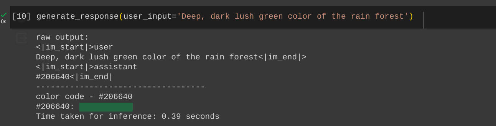

# Fine-tuning TinyLlama

Used [LoRA](https://huggingface.co/docs/diffusers/main/en/api/loaders/lora) to prompt-engineer [TinyLlama](https://huggingface.co/TinyLlama/TinyLlama-1.1B-Chat-v1.0) for giving hex color codes from color description.

# Demo

# Run model inference

- Note: you need GPU to run this or you can use Google Colab

Head to [Fine-tuned model inference](./finetune_TinyLlama.ipynb) section in the python notebook for model inference

